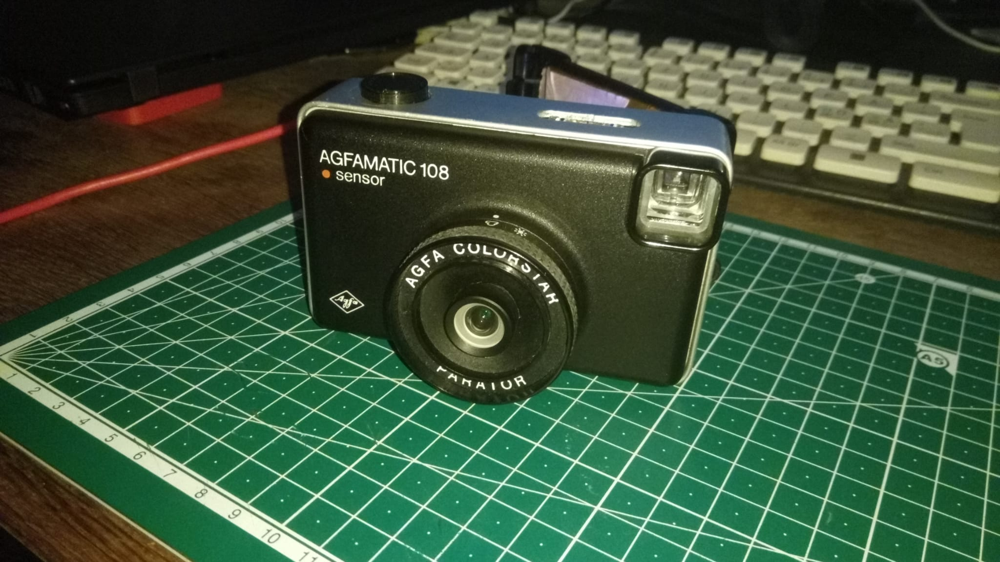
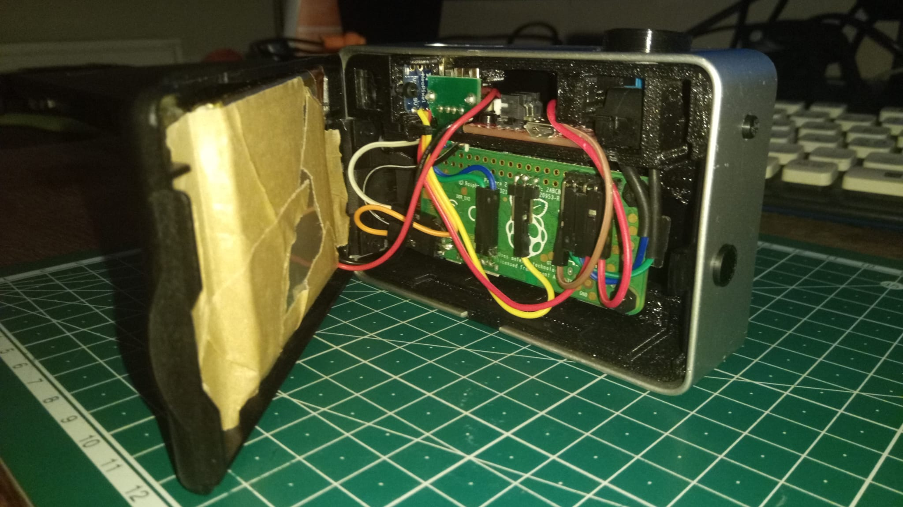
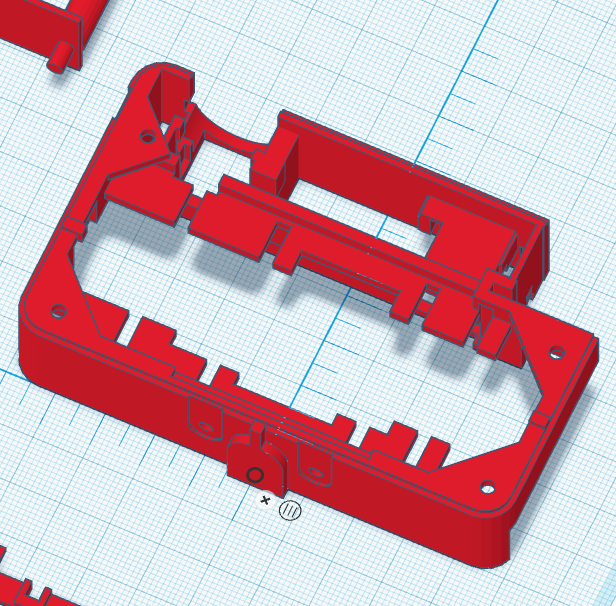
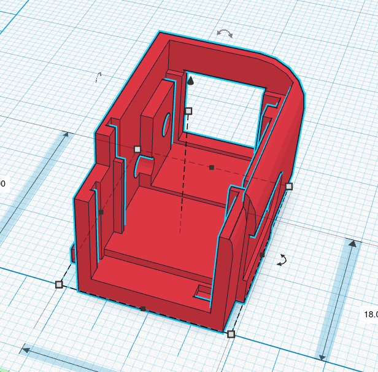
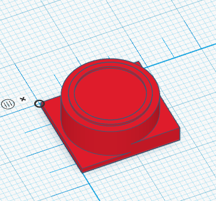

# suicam2

Follow-up project of the [$uicideCam](https://derwerderwer.wordpress.com/)... But open source and (more or less) easily reproducible :)

The project is de facto finished but needs to be documented. The cam is already working :)

The main code of the camera is written around the availability of a USB storage device. Therefore, the code base may be of interest to projects using removable storage devices, even if the data producing part of the project is not a camera.

- based on the agfamatic 108
- analogue parts are replaced by digital ones
- images are stored on USB stick for an analogue experience
- python code for easy programming
- build your own filter...
- original analog viewfinder
- runs on a raspberry py, the raspberry HD cam and raspbian

# folders

## 3D_prints

3D models to replace the inner parts with new ones allowing easy assembly of the new components

3 parts are needed:

- inner workings (large part that basically replaces everything inside)
- reprint of the viewfinder
- knob ... choose your color :)

## code

main code running on the camera (add it to .bashrc with sudo rights)

## test_code

code to test the different hardware parts and adjust the cam

## filter_playground

a few notebooks to develop and tune your own filters ?

## pictures

well...

# TO DO

- list of parts
- filter playground examples
- use the cam :P
- installable package ?
- test functions garden
- write a tutorial
    - general interesting stuff
        - the cam itself
        - concept
        - USB mounting, sync
        - filters
        - raspberry pi
    - dismantling and assembly        
    - soldering and circuit
    - setting up the pi
    - software
    - filters
